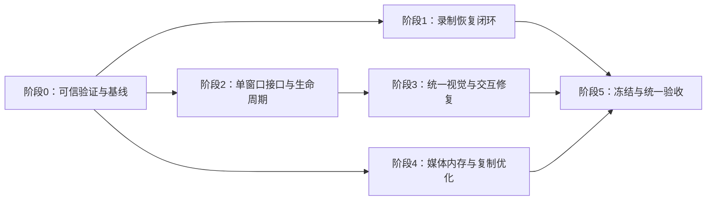

# Panzo 下一步开发方案：单主窗口与审查问题修复

日期：2026-09-26  
状态：已进入实施；代码变更、实际验证结果和未关闭项见[开发记录](Development-Progress-2026-09-26.md)。本方案的关闭条件继续有效，不能将已实施等同于全部验收通过。  
范围依据：本轮代码／项目审查、随后 UI 一致性审查，以及用户明确提出的“一个主窗口内完成打开工程、编辑和新录制”。

本轮目标是：修复已确认的恢复与交互缺陷，将现有录制、编辑和导出操作整合到同一主窗口，统一公共视觉与反馈规则，并使测试结果和交付程序可追溯。

## 1. 范围和当前基线

### 1.1 本轮开发边界

- 只优化、修复或重组已经存在的操作；单主窗口是现有功能的容器与生命周期重构。
- 保持单工程、单次录制语义；不引入多文档、并行录制、工程库、音频、外部视频、多轨、字幕或其他编辑能力。
- 保留现有 Win32 主机、D3D11 预览和媒体 worker；本轮不迁移 UI 框架，不将媒体工作放回 UI 线程。
- 保留当前深浅主题、中文、SVG 图标、DPI 缩放、布局偏好和可访问性。录制准备区与编辑工作区允许不同信息密度，但共用应用外壳和同类控件规则。
- 不为这轮界面重构主动升级工程编辑 schema；沿用现有 schema 兼容与原子保存机制。必要的内部恢复记录须明确版本和向后兼容策略。
- “单窗口”指一次应用会话只有一个业务主窗口。预览子 HWND、系统文件选择器和临时确认对话框不算第二个业务主窗口；不增加跨进程单实例或 IPC 能力。

### 1.2 已有证据与验证边界

2026-09-26 审查时实际完成：`cargo fmt`、`cargo clippy`、工作区测试和 CLI 构建；201 项测试通过、17 项显式忽略。测试数量是基线，不是后续必须维持不变的指标；被忽略的专项不得记为通过。

在独立 `.tmp` 目录使用 1 秒合成视频确认：

1. 录制中断工程被标记 `Recovered` 后，预览仍因缺少 `tracks/camera.json` 失败。
2. manifest 指向 `screen.part.mp4`、媒体已经改名为 `screen.mp4` 时，恢复失败。
3. `Processing` 工程缺少 `recording.lock` 时，不进入现有扫描结果。

验收脚本最小复现确认：子脚本 `exit 17` 未被父层 `catch` 捕获，父层仍可能记 `Pass`。打包目录哈希核对确认：默认目标目录中的程序与 9 月 5 日旧候选相同，却会配入 9 月 19 日说明。

UI 审查依据当前实现和仓库 9 月 19 日截图，未把历史截图视为当前构建的实机视觉复验。持续拖动长尾、完整物理输入、Windows 11／跨屏等历史未闭环项仍按原验收计划记录，不能因为本轮局部修复而自动关闭。跨 GPU 与自动运镜自然度继续保留原有延期边界。

## 2. 全部问题与工作包映射

下表将两轮审查中的复合问题拆为 18 个主修复项，另列 2 个已定位的同类低优先级整理项。全部初始状态为“待实施”，复现成功仅代表问题已确认。

文件简称：`win/` = `crates/panzo-windows/src/platform/`，`core/` = `crates/panzo-core/src/`，`app/` = `crates/panzo-app/src/`。

| ID | 对应问题 | 优先级 | 主要文件 | 工作阶段 | 关闭证据 |
|---|---|---|---|---|---|
| R01 | 恢复成功但缺镜头文件，工程不可用 | 高 | `win/recovery.rs`、`recorder.rs`、`editor.rs` | 1 | 恢复后打开、编辑、保存重开、导出全部成功 |
| R02 | 收尾改名、状态提交和删除恢复锁之间存在空隙 | 高 | `win/recorder.rs`、`recovery.rs`、`manifest_store.rs`、`core/project.rs` | 1 | 收尾各边界中断、重复恢复及遗留状态矩阵通过 |
| P01 | MP4 检查把整个文件读入内存 | 中 | `win/fmp4_writer.rs`、`recovery.rs` | 4，可前置 | 容器结果不变，内存不随 mdat 字节数线性增长 |
| P02 | 代理时间映射深拷贝整帧像素 | 中 | `win/decode_worker.rs`、`media_decoder.rs`、`preview_proxy.rs` | 4 | 映射前后共享像素；时间戳、预算、端到端性能回归通过 |
| U01 | 裁剪手势丢失捕获后仍编辑 | 中 | `win/preview_window.rs`、`editor_crop.rs` | 3 | 捕获转移后回滚、普通移动无修改、无多余撤销 |
| U02 | 导出面板参数与启动快照不一致 | 中 | `win/export_window.rs`、`workbench_actions.rs`、`editor_tasks.rs` | 3 | 面板参数、冻结快照和成片规格一致 |
| U03 | 裁剪锁未发布辅助技术开关状态 | 中 | `win/preview_window.rs`、`accessibility.rs` | 3 | 外部 UIA 可读状态，切换与通知各发生一次 |
| U04 | 高 DPI 窄窗口的长时间码覆盖按钮 | 低 | `win/editor_layout.rs`、`editor_chrome.rs` | 3 | 实际字宽与控件区域不重叠，紧凑布局仍可操作 |
| E01 | 嵌套脚本非零退出仍可能记 Pass | 中 | `scripts/verify-recording-editing.ps1`、被调用验证脚本 | 0 | 预期／非预期失败的最小夹具正确判定 |
| E02 | Fail 未传播为顶层非零退出 | 中 | `scripts/verify-recording-editing.ps1`、`verify-re-mvp-final.ps1` | 0 | 子级 Fail、缺报告、缺必测项均阻断，证据仍落盘 |
| E03 | 默认打包旧程序并混入新说明 | 中 | `scripts/package-re-mvp.ps1`、构建／回归脚本 | 0、5 | 构建、测试、包内两个 EXE 的身份一致 |
| S01 | 双主窗口打断录制编辑流程 | 高 | `app/gui.rs`、`win/recorder_window.rs`、`preview_window.rs` | 2 | 两种启动方式与完整任务仅使用一个业务主窗口 |
| S02 | 返回录制器等同关闭，直接开工程时退出应用 | 中 | `app/gui.rs`、`win/preview_window.rs` | 2 | 返回仅切换内容，退出才结束主循环 |
| S03 | 取消关闭后仍残留退出意图 | 中 | `win/recorder_window.rs`、`preview_window.rs`、`editor_tasks.rs` | 2 | 取消／保存失败后意图清空，后续返回不退出 |
| V01 | 录制与编辑使用不同标题栏结构 | 高 | `win/recorder_window.rs`、`editor_titlebar.rs`、`editor_layout.rs` | 2、3 | 所有工作状态共用一套标题区及窗口控制 |
| V02 | 全局导航藏在设置，齿轮职责混杂 | 高 | `win/recorder_window.rs`、`workbench_actions.rs` | 2、3 | 新录制／打开工程位置固定，设置职责稳定 |
| V03 | 同类按钮的尺寸和状态绘制分叉 | 中 | `win/editor_ui.rs`、`recorder_window.rs`、`preview_window.rs` | 3 | 同角色控件在两种工作区的状态视觉一致 |
| V04 | 状态反馈依赖不同字符串规则 | 中 | `win/recorder_window.rs`、`editor_chrome.rs`、`preview_window.rs` | 3 | 等待／提示／成功／失败语义一致，文案变化不影响显示 |
| L01 | Tooltip 的贴边定位逻辑重复且不同 | 低 | `win/recorder_window.rs`、`preview_window.rs`、`editor_ui.rs` | 3 | 共用定位规则，窗口四边不裁切 |
| L02 | 验收相对输出路径随工作目录切换改变含义 | 低 | `scripts/verify-m1.ps1`、`verify-m4-recovery.ps1`、`verify-m4-stability.ps1` | 0 | 从项目外启动、含空格／中文路径均写到指定位置 |

## 3. 用户可见的最终工作方式

### 3.1 主窗口组成

采用一个稳定标题区和一个可切换内容区，不再为录制器另设一排品牌工具栏。

- 应用级入口：新录制、打开工程和设置，位置在录制与编辑状态下保持一致。
- 工程级信息：当前工程名、未保存／保存中／已保存／保存失败；保存和导出按当前状态启用。
- 系统窗口控制：最小化、最大化／还原、关闭，保留原生行为和命中规则。
- 内容区：复用录制准备、录制状态、编辑器预览／属性／时间线。
- 导出设置和进度作为主窗口内面板；输出快照仍独立于后续编辑。

具体宽度以现有字体与 DPI 实测确定；紧凑布局可以将低频操作放进已有溢出菜单，但“新录制”和“打开工程”必须可发现，不能只依赖无说明图标或禁用按钮。

### 3.2 状态与操作契约

| 当前状态 | 允许的主要操作 | 转换规则 | 失败或取消后 |
|---|---|---|---|
| 未打开工程 | 新录制准备、打开工程、继续最近工程、主题设置 | 在同一主窗口加载目标内容 | 留在当前内容，显示可理解错误 |
| 编辑工程 | 编辑、保存、导出、新录制、打开工程 | 切换工程前完成输入与未保存处理 | 保留当前有效工程、撤销状态和可操作界面 |
| 录制准备 | 选择来源、开始、返回现有可用工作状态 | 不以进入设置页作为实际录制开始 | 取消准备不得创建多余录制工程或清除未确认放弃的修改 |
| 正在启动／录制 | 停止、查看时长与阶段 | 重复开始请求被拦截；不允许并行新录制 | 停止后进入收尾；错误保留可恢复工程 |
| 正在收尾 | 查看进度、等待完成 | 必需文件和最终状态提交后才进入编辑 | 继续显示失败／恢复结果，不把点击停止当作完成 |
| 正在保存 | 当前工程可继续编辑 | 切换意图等保存结果；保存后的新修改仍算 Dirty | 保存失败或出现新的未确认修改时不自动离开 |
| 正在导出 | 当前工程可继续编辑、查看进度、取消导出 | 切换工程／退出复用现有取消确认；异步等任务清理结果 | 取消确认则留在原工程；取消任务不删除既有输出 |

系统文件选择器可以使用原生对话框。关闭导出面板与“取消导出”继续保持不同语义：收起面板不静默取消正在运行的导出。

### 3.3 统一处理切换意图

使用明确的待执行操作区分 `OpenProject`、`NewRecording`、`ReturnToRecording` 与 `Quit`；这些是内部状态，不是新增用户功能。

处理次序：

1. 按现有输入规则提交合法文本；非法输入保留并提示。活动拖动明确完成或回滚，不留下半个编辑组。
2. 处理已有背景载入、保存、导出和录制任务；通过异步完成事件推进，UI 线程不阻塞等待。
3. 对未保存修改复用“保存／不保存／取消”；选择取消立即清空本次切换意图，保存失败同样不自动执行原动作。
4. 打开目标工程时先校验并准备必要状态，成功后再替换当前有效会话；失败不提前丢掉原会话。临时加载候选不意味着支持多个可编辑文档。
5. 替换内容时失效旧解码请求、后台回调、焦点、Tooltip、输入框和 UIA 节点；更新当前工作区后再发布状态。
6. 只有真正退出应用才销毁主窗口、结束消息循环；工作区切换不调用 `PostQuitMessage`。

“不保存”只在实际离开得到确认时清除草稿，并保证在途草稿写入不会把已丢弃内容重新写回。取消文件选择或新工程加载失败，不应等同于用户已经离开当前工程。

## 4. 阶段 0：可信的验证与版本基线

覆盖 E01、E02、E03 的前置约束和 L02。先修验证判定，再用其结果评价后续改动。

### 实施步骤

1. 建立本轮唯一的候选输出目录，例如 `target/review-unified/release`；构建、测试、打包显式传入同一目录或可执行文件路径。
2. 记录 Rust 版本、操作系统／GPU、两个 EXE 的 SHA256、测试素材 Hash、构建参数与时间。当前目录没有 Git 元数据，先用源码／配置清单 Hash 标识基线，不依赖不存在的提交号。
3. 统一验证脚本失败协议：非预期失败使用明确异常或子进程退出状态；预期故障注入的非零退出在负责该用例的脚本内消费，并检查恢复断言。
4. 不直接把共享的 `$LASTEXITCODE` 当成整个子脚本结果；同时检查结构化用例结果与正向完成证据，空输出、缺结果不能视为成功。
5. 顶层在 `finally` 保存日志／JSON，随后汇总本层和嵌套用例。有 `Fail`、必需用例缺失、无报告、超时或构建 Hash 变化时非零退出。
6. 保持 `Pass / Fail / NotRun / Deferred` 四种结果。脚本报错不得绕过报告；被忽略的必测专项必须单列执行，不能靠汇总数字混入 Pass。
7. 所有输出参数在切换工作目录前按约定解析成绝对路径；使用同一语义贯穿素材副本、日志、子进程和结果路径。
8. 打包脚本先验证目录、二进制及证据身份再复制；候选文档必须来自同一轮范围，旧证据只能标为历史。

### 完成标准

- 最小夹具覆盖成功、`throw`、非预期 `exit 17`、预期故障退出、空日志、子报告 Fail、缺报告、Hash 不一致；每种情况的顶层退出和报告一致。
- 从仓库外运行，使用含空格／中文的相对和绝对输出路径，结果位置一致。
- 本轮可重复运行基础检查，保存每项退出码与日志。对纯文案／轻量布局改动不新增镜像测试；对状态、事务、失败传播编写有行为价值的回归。

## 5. 阶段 1：录制收尾与恢复闭环

覆盖 R01、R02。主要改动 `recorder.rs`、`recovery.rs`、`manifest_store.rs`、`core/project.rs`，复用 `editor.rs`、`editor_transaction.rs` 的现有加载与持久化契约。

### 5.1 共用工程完成逻辑

- 从正常录制收尾中抽取“使录制工程具备可编辑所需文件”的内部职责，供正常结束与恢复调用；不要重新实现第二套 Planner 或编辑保存系统。
- 以检查得到的有效媒体时长和修剪后的点击事件为依据，恢复必要的镜头轨道和工作台默认值；默认镜头效果关闭、视频保留全长，与正常录制保持一致。Planner 失败沿用现有原画面、无镜头效果回退，不能阻断可用媒体进入编辑。
- 已存在且有效的镜头、工作台、手工编辑和自动初稿保持原样。损坏编辑文件不能被悄悄重建为默认值后宣称恢复成功；应保留原文件和错误证据。
- 在必要文件完整、可校验并持久化后才发布恢复成功／Ready。写到一半的临时文件不作为有效输入；诊断统计写入失败不能单独把已具备必要文件的工程判为不可编辑。

### 5.2 收尾和恢复必须可重复执行

显式覆盖下列状态，而不是只把删除锁的代码向后移动：

| 磁盘状态 | 处理要求 |
|---|---|
| `Recording/Finalizing`，只有 part 文件 | 检查完整片段，按现有规则处理无效尾部，补齐工程后提交 |
| manifest 仍指向 part，但只有 final 文件 | 识别正常改名后的中断，验证 final 后修正引用并继续完成 |
| `Processing`，有锁 | 恢复完成阶段，不能因不允许状态转换直接标失败 |
| `Processing/Finalizing`，旧版本已删锁 | 纳入已有工程恢复扫描的遗留状态识别；须取得互斥并排除仍活动的工程 |
| `Ready/Recovered`，锁残留 | 验证工程完整后只清理残留标记，不强制再转换为 Recovering |
| 旧版本已标记 `Recovered`、无锁但缺少必要初始化文件 | 在现有恢复扫描／打开完整性检查中识别；确认无活动写入后补齐缺失项，不能因终态名称直接跳过 |
| part 与 final 同时存在 | 保留两者并报冲突，不能猜测或覆盖原媒体 |
| 必需文件已存在、恢复重复执行 | 重复执行不覆盖编辑、不追加重复历史、不改变有效媒体 |
| 写入失败／磁盘不足／临时不可访问 | 保留可恢复状态与证据；不能一律删除锁并永久失去重试入口 |

所有录制完成／恢复写入使用同一互斥边界，防止另一个扫描器或仍存活的录制任务并发修改。无锁遗留状态需安全识别所有者／活动写入，不能把“没有录制锁”简单等同于“可以改写”。

媒体改名必须保持不覆盖已有目标的语义。现有 `move_file_atomically` 使用替换语义，不能直接套用到原视频发布。工程内部记录可复用现有原子落盘工具，但必须区分“创建”“替换元数据”和“发布原媒体”。

### 5.3 故障注入与完成标准

在至少以下边界前后构造独立子进程故障：编码器 finalize、事件 checkpoint、媒体改名、manifest 更新、镜头发布、工作台发布、最终状态提交、恢复锁清理；另在恢复执行过程中再次中断。

- 每个可恢复用例执行恢复两次，状态和内容一致；在正确状态完成后只剩合法持久化文件。
- 每个用例均能通过现有编辑器打开、一次编辑／撤销、保存重开、短片导出及完整解码。
- 完整源媒体的编码载荷保持不变；尾部损坏恢复允许按既有规则裁掉无效尾部，但保留前缀的 Hash 不变。事件修剪只针对可恢复视频范围之外的记录。
- 已有手工镜头、工作台及保存事务中断工程不被默认初始化覆盖。
- 活动录制不被恢复扫描触碰；竞争扫描不会双写。
- 保留现有 5/5 强制中断恢复与 10 个编辑保存事务故障点，并补齐恢复后可用性的断言。

## 6. 阶段 2：单主窗口及生命周期重构

覆盖 S01～S03、V01/V02 的结构部分。这是本轮产品体验主线，不能只隐藏旧录制器窗口就当作完成。

### 6.1 文件与职责调整

| 范围 | 要做的调整 | 保留的实现 |
|---|---|---|
| `app/gui.rs` | 无参数／带工程路径都进入相同主窗口；参数只决定初始工作状态 | GUI 子系统、启动错误处理 |
| `recorder_window.rs` | 分离顶层窗口职责与录制内容／控制逻辑，不再拥有独立编辑器线程和第二个业务主窗口 | 来源选择、RecordingControl、录制阶段反馈 |
| `preview_window.rs` | 分离工作区挂载／卸载、输入和绘制；页面关闭不销毁应用 | PreviewSession、编辑手势、时间线与选中状态 |
| `editor_titlebar.rs`、`editor_layout.rs` | 提供统一标题区和内容边界 | 原生窗口命中、DPI、最大化／还原和预览子窗口隔离 |
| `workbench_actions.rs`、`editor_tasks.rs` | 命令通过主窗口切换意图执行；后台完成带有会话身份 | 保存／导出快照、后台 worker、取消能力 |
| `editor_draft.rs`、`accessibility.rs` | 定义卸载时清理与失效规则 | 草稿事务、UIA snapshot／有界命令队列 |

可以按这些职责拆分现有 Rust 文件，具体文件名在实施时确定；内部代码拆分不构成新增产品模块。避免把两个大型 WindowState 原样拼成一个更大的结构。

### 6.2 迁移顺序

1. 先定义主窗口状态、工作区挂载／卸载和切换结果；把“成功离开／取消／失败”变为明确结果。在迁移前固定 Back、取消退出、裁剪取消和导出快照的失败回归，迁移后复用同一批用例区分旧缺陷与新回归。
2. 统一主循环和顶层窗口生命周期；两种启动方式只创建一个业务主窗口。保留必要的 Win32 子窗口，不能仅依靠 `SetParent` 或顺序调用两个 `run()`。
3. 接入录制内容，在同一窗口开始、停止、收尾并加载结果工程。
4. 接入打开工程和新录制，按第 3 节统一处理未保存内容及后台任务。
5. 拆开返回与退出路径，清理旧 `close_when_finished` 跨窗口隐含协议。
6. 将导出视图接入窗口内面板，保留原有进度、取消、结果打开和不覆盖输出行为。
7. 适配现有 CLI／原生事件探针，使其调用同一工作区逻辑。旧命令参数和可解析报告尽量保持兼容；确需调整的输出与脚本在同一工作包修改，不维护独立的旧版产品 UI。

### 6.3 必须一起处理的生命周期边界

- 页面卸载前清理 capture、pressed、hover、Tooltip、inline input、timer 和工作区专属消息。取消裁剪时先清空手势状态再释放捕获，防止捕获消息同步重入导致重复提交／取消。
- 旧工程的解码／缩略图／背景完成事件携带会话代次，切换后不能写入新工程或新 HWND；不能以等待所有媒体工作结束来阻塞消息循环。
- 保存结果只能确认对应快照；保存期间的新修改不能被清除。切换工程需要等待必要保存完成并重新检查 Dirty。
- 退出或取消导出时，主窗口通过异步结果确认临时文件清理；不能发出取消后立刻结束进程。正常卸载预览保持原有非阻塞取消能力。
- UIA 目前两类窗口会复用控件数字 ID。合并到相同 HWND 后，按工作区代次失效旧 provider、清空旧动作队列并发布新树，防止旧节点激活新页面同编号按钮。
- 主窗口的位置、尺寸、主题不随模式切换跳变；保留现有属性宽度、时间线高度等偏好，各布局仍受当前工作区限制。

### 完成标准

用无参数启动和直接工程路径启动分别完成：录制→编辑→打开另一个工程→新录制→再次编辑。除临时系统对话框外，始终只有一个业务主窗口，主窗口身份与位置保持稳定。

另覆盖：取消打开文件、加载损坏工程、未保存三种选择、保存失败、保存期间继续编辑、取消退出后再次返回、导出期间切换、录制收尾时退出、旧 worker 回调晚到、20 次连续工作区切换、UIA 持有旧节点后切换。所有取消和失败路径都不得留下自动退出或误执行下一步的意图。最近工程指针仅在目标成功加载后更新，避免主窗口仍显示 A、继续编辑入口却指向打开失败的 B。

## 7. 阶段 3：统一视觉、导航和现有交互

覆盖 V01～V04、U01～U04、L01。在阶段 2 的主窗口边界明确后集中落地，避免先美化两套即将合并的标题区。

### 7.1 公共视觉和入口

- 统一标题区高度、内容基线、工程标题、设置及系统窗口按钮；固定“新录制／打开工程”的位置。
- 复用 `EditorTheme`、现有字体测量和 SVG，不另建一套主题。明确定义主操作、标准按钮、工具按钮、开关各自的尺寸、圆角、图标颜色和状态。
- 合并 Recorder／Editor 重复的按钮绘制与 Tooltip 定位；同角色控件共用 hover、pressed、focus、selected、disabled 规则。
- 设置菜单收敛到现有全局偏好与诊断；移动既有编辑命令时保留完整能力，例如不能因移走设置项而丢掉当前仅在该处提供的焦点精确输入或光标倍率。
- 以明确的消息类型／级别替代基于关键词的 `contains()` 显示条件；公共状态区显示简短中文摘要，技术详情进入已有诊断。状态不占用时间标尺。
- 录制准备内容可居中、编辑内容可高密度；统一公共基线与组件，不强制每个内容区使用相同留白。

### 7.2 裁剪与可访问性

- 捕获丢失、取消模式、页面切换均进入统一手势取消入口，将 `crop_drag` 纳入条件。
- 回滚裁剪草稿后释放 capture、关闭编辑组；普通鼠标移动不再改变值，不新增撤销记录。
- 比例锁沿用已有 Toggle provider，发布开关状态和属性变化；鼠标、键盘、UIA 操作状态一致。
- 保留焦点可见性、中文名称、合理 Tab 顺序，确认空格／Delete 在文本输入状态不触发全局操作。

### 7.3 时间码与紧凑布局

- 播放条按“固定必要按钮＋可用时间文字区域”分配宽度，文字区域不得穿过属性栏开关。
- 使用当前主题／DPI 的实际字宽，覆盖长时长、多位分钟和当前／总时长组合；不能只比较按钮矩形。
- 空间不足时调整已有控件间距、排列或折叠次要内容，保持完整时间值和操作可达，不靠缩小字体掩盖问题。
- Tooltip 依据窗口四边选择位置并限制最终边界；保留各操作自己的中文说明与快捷键。

### 7.4 导出面板与快照一致性

采用明确规则：面板空闲时跟随当前编辑状态；点击开始时，先提交有效输入，再冻结面板所展示的同一份快照。面板显示的画布尺寸、预设尺寸、时长、输出路径必须来自该快照或其明确配置。

导出期间，进度与参数保持对应已启动快照；继续编辑不改变本次输出。完成／取消后再次导出，刷新为当时的最新状态。返回面板不得继续展示上次工程参数。

验收包括：打开面板后改画布、裁剪／删除改变时长、修改速度、撤销、切换工程、运行中继续编辑；成片尺寸／时长与启动时面板一致。关闭面板、取消导出、取消退出三种操作分别验证。

### 7.5 视觉完成标准

按当前 Release 构建截取真实窗口，覆盖深／浅主题、100%／125%／150%／200% DPI、标准与紧凑尺寸、最大化／还原、长中文工程名、长时间码及非 16:9 画布。物理工作区无法容纳组合时，验证实际工作区适配并单列结果，不能把未执行矩阵填为 Pass。

每种主要状态保留截图：未打开工程、录制准备、录制中、收尾、编辑、参数输入、导出设置／进度／失败。截图用于排版与视觉判断；动态闪烁、键鼠行为和读屏必须有独立操作证据。局部绘制测试不能替代真实主窗口检查。

## 8. 阶段 4：媒体内存和拖动复制优化

覆盖 P01、P02。可在阶段 0 完成后与主窗口工作并行，但媒体／GPU 性能验收串行执行。P01 应在最终长录制与恢复回归之前完成。

### 8.1 流式 MP4 检查

- 读取文件长度与 box header，使用 `u64` 偏移及有检查的加法；跳过 mdat 等不需要读取的载荷。
- 只缓冲必要元数据，逐片段累计时间信息；不收集全部 moof。必要时使用两次轻量顶层扫描，先读取 moov 参数，再逐片段解析，避免单遍实现改变原本接受的 box 顺序。
- 保留普通／扩展 box 长度、size=0、moof/mdat 配对、默认采样时长、tfdt／trun 时间戳与截断边界的现有语义。完整 moof 之后的 mdat 若不完整，计数、时间和保留边界只能提交到上一个完整片段。
- 对声明超出文件范围、整数溢出、异常嵌套或过大元数据明确报错；区分可恢复的尾部不完整与已提交片段内部损坏，不能为了节省内存而宽松接受损坏文件。检查函数保持只读，只有恢复调用方在独占条件下按验证结果截断。
- `export_timing.rs` 已经流式复制，此处集中修复 `inspect_fmp4`，避免重复改造。

验收分两部分：小文件上旧／新检查结果逐字段一致；大文件上固定元数据、扩大媒体载荷，验证内存不随载荷线性增长，并覆盖超过 4 GiB 的偏移。大型解析夹具可以使用稀疏／合成文件，但不能用不可解码夹具替代真实媒体恢复与导出验收。

基线先记录解析器缓冲上限、进程私有内存峰值和元数据规模，再冻结内存预算；测试必须能证明不存在整文件分配。耗时与取消响应同时记录，不以单个平均数评价。

### 8.2 共享代理帧像素

- 将可共享的像素缓冲与帧时间元数据分离；时间映射只产生轻量帧描述，不能深拷贝 BGRA。选择共享容器时也检查首次包装是否复制已有 Vec，不能把整帧复制从映射阶段移到解码出口后称为消除。
- 下游合成接口优先读取只读切片，缓存使用共享所有权；缓存保留代理 PTS，发布描述使用映射后的源 PTS，不能原地改缓存帧。复核合成器的 PTS／尺寸／像素身份缓存键，确保同 PTS、不同像素内容不会误用旧纹理。
- 保留缓存字节预算、在途请求上限和取消语义。共享缓冲不应导致缓存淘汰后无限滞留；统计要区分缓存持有与仍在使用的帧。
- 覆盖缓存命中／未命中、代理／原素材、前进／倒退／反转、跨剪辑／变速、松手精确定位和切换工程。

验收既检查共享像素身份／分配计数，也做同素材同条件性能对照；代理时间重映射自身新增的整帧分配和复制次数必须为 0。缓存淘汰后仍被预览持有的帧必须有效，关闭后引用能够释放。P95 改善但 P99、最长画面间隔或内存变坏时，继续定位，不能直接宣布整体优化通过。

## 9. 阶段 5：统一回归、候选冻结与交付

### 9.1 回归矩阵

| 类别 | 必需场景 | 通过条件 |
|---|---|---|
| 基础检查 | fmt、Clippy、工作区全部常规测试、GUI/CLI 构建 | 命令和报告一致；新增行为测试通过；忽略项分类明确 |
| 工程恢复 | 录制中断、收尾所有中断点、遗留无锁状态、重复恢复、正常活动工程 | 工程可打开与导出，内容保护与幂等满足阶段 1 |
| 单窗口流程 | 两种启动、录后编辑、打开别的工程、新录制、取消／失败、20 次切换 | 一个业务主窗口；无意外退出、残留任务或旧页面动作 |
| 编辑正确性 | 原有裁头尾、分割删除、变速、画面裁剪、镜头、背景、画布、光标 | 统一撤销、保存重开与源／工程时间映射保持正确 |
| 持久化 | 10 个保存事务故障点、后台保存、草稿丢弃／恢复、旧 schema | 恢复完整修订，未知 schema 不写坏，取消不清除有效修改 |
| 导出 | 原尺寸／1080p、横／竖／方画布、参数刷新、快照隔离、取消、同名文件 | 面板、快照与成片一致；完整解码；现有输出和工程不受损 |
| UI 与辅助技术 | 双主题、DPI／尺寸、窗口系统操作、键鼠、输入法、Tooltip、UIA | 无遮挡、重复操作、失焦误编辑；旧节点不激活新工作区 |
| 性能与资源 | F01～F05 冷／热打开、定位、播放、5 分钟持续拖动、长视频检查 | 满足既有门槛；无旧帧倒灌、无界队列或载荷线性内存增长 |
| 录制稳定性 | 当前最终候选 30 分钟录制、5/5恢复 | 使用原稳定性阈值，无静默降低分辨率／帧率 |
| 交付身份 | 候选构建、测试证据、包内 EXE、说明与清单 | 两个 EXE Hash 一致；包内 smoke 使用被验收的确切文件 |

### 9.2 性能门槛沿用现有计划

完整口径见 [Recording-Editing-Acceptance-Plan.md](Recording-Editing-Acceptance-Plan.md)，本轮不通过放宽阈值关闭历史问题。重点门槛如下：

| 指标 | 必须满足 |
|---|---|
| 拖动事件 UI 处理 | P95 ≤16.7 ms，P99 ≤33.4 ms |
| 指针到播放头反馈 | P95 ≤50 ms，最大 ≤100 ms |
| 拖动到对应预览 | P95 ≤150 ms，最大 ≤300 ms；每 2 秒至少 48 次有效更新 |
| 松手／单击到精确帧 | P95 ≤250 ms，最大 ≤750 ms |
| 定位后播放首帧 | P95 ≤250 ms，最大 ≤750 ms；播放意图响应 ≤50 ms |
| 1440p60 连续播放 | Present 间隔 P95 ≤25 ms，P99 ≤50 ms，最大 ≤100 ms |
| 暂停 5 秒 | 不重复解码／合成；正常 GPU 预览 Readback 为 0 |

F01～F05 按素材及冷／热态分别报告；离散定位、松手、播放各类不少于 100 个样本，保留三轮前进、后退和反转。代理首次准备时长、命中状态、P99、最长停滞和媒体错误数不可省略。软件 Present 测量与实际可见反馈分别说明。

### 9.3 最终放行与交付物

1. 冻结 Release 构建并记录源码／配置清单、工具链、GUI/CLI Hash；之后代码或构建发生变化，受影响检查必须重跑，不能沿用旧成绩。
2. 原有完整 GUI 任务执行至少三轮：录制、裁头尾、分割删除、调整镜头／背景、保存重开、导出并打开结果。补充编辑后直接新录制／打开工程路径。
3. 本轮必需项有 Fail 或 NotRun，均不能声明整体完成；原已明确 Deferred 的设备／功能边界继续单列，不将其记 Pass，也不扩大本轮范围。
4. 打包前检查本层与嵌套报告、必测项完整性及两个 EXE Hash。历史截图与报告明确标历史，不能绑定到新 EXE 冒充新验收。
5. 从新包启动做短流程 smoke；保持旧候选可运行，不覆盖用户工程或旧交付目录。
6. 输出候选目录／ZIP、校验清单、逐项验收报告、更新后的使用说明与已知问题。`Acceptance-Report.md` 只在实际复验后更新状态。

## 10. 实施顺序、并行分工与变更控制

阶段 1 与阶段 2 可以在阶段 0 后并行；阶段 2 的正常录制→编辑最终验收依赖阶段 1 的完成契约。公共 UI token／组件整理可在主窗口接口确定后开始。媒体性能修改可独立推进，GPU 压力测试、录制稳定性与视觉交互采样串行执行，避免相互污染。

| 工作组 | 文件所有权／责任 | 集成边界 |
|---|---|---|
| A：主窗口与工作流 | `gui.rs`、`recorder_window.rs`、`preview_window.rs`、`workbench_actions.rs`、`editor_tasks.rs`、`export_window.rs` | 唯一负责入口和窗口状态；接受 UI／媒体组接口，不并发改同一主文件 |
| B：公共 UI 与可访问性 | `editor_ui.rs`、`editor_titlebar.rs`、`editor_layout.rs`、`editor_chrome.rs`、`accessibility.rs`、`editor_crop.rs` | 控件不持有工程／媒体状态；涉及 `preview_window.rs` 的小修由 A 集成 |
| C：恢复与媒体性能 | `recorder.rs`、`recovery.rs`、`manifest_store.rs`、`core/project.rs`、`fmp4_writer.rs`、`decode_worker.rs`、`media_decoder.rs`、`preview_proxy.rs` | 恢复与流式检查共用文件时按任务顺序提交；不改 UI 消息循环 |
| D：验证与交付 | `scripts/`、回归素材清单、构建身份、验收和说明文档 | 决定结果判定和证据归档，不凭界面截图替代行为测试 |

一个文件同时只有一个修改负责人；其他工作组提供接口需求或补丁建议，由负责人合并。所有修改保留他人已有变更，不以大范围格式化或改名掩盖行为变化。

开发按依赖连续执行，阶段完成条件用于质量判断，不要求每阶段重新请求用户批准。视觉与完整操作验收仍需真实证据，不能由单元测试替代。当前仅交付方案，不启动产品代码实施。

工期以工作包和完成条件管理；先完成阶段 0 并验证主窗口迁移切片，再根据真实复杂度估算，不预先承诺固定完成日期。

## 11. 第一批可直接执行的任务

| 顺序 | 任务 | 完成后可审阅的结果 |
|---|---|---|
| 1 | 修 E01/E02，并统一候选目录与路径语义 | 最小失败矩阵、可靠的顶层退出码及结构化报告 |
| 2 | 固定恢复失败夹具和当前源码／构建身份 | 可重复失败的恢复／预览用例，不触碰用户原工程 |
| 3 | 落地 R01/R02 的共用完成逻辑与遗留状态恢复 | 恢复后可编辑／导出的测试，以及收尾故障矩阵 |
| 4 | 并行确定主窗口状态与切换意图，迁移两种启动入口 | 一个主窗口内打开已有工程、返回和再次打开的可运行切片 |
| 5 | 接入新录制、录后编辑、保存／取消／退出与导出面板 | 单窗口端到端流程和取消路径回归 |
| 6 | 统一公共视觉并完成 U01～U04；并行完成 P01/P02 | 当前构建截图、UIA／交互记录、媒体性能前后对照 |
| 7 | 冻结候选，执行完整矩阵，再打包 | 与包内程序 Hash 对应的验收报告和使用说明 |

## 12. 文档衔接

- [PROJECT-PLAN.md](../PROJECT-PLAN.md)：本方案作为下一轮执行补充；旧 R0～R5 记录保留历史事实。
- [Recording-Editing-UI-UX-Spec.md](Recording-Editing-UI-UX-Spec.md)：实施时同步单主窗口、标题区、导航与反馈规则，替换双窗口相关描述。
- [Recording-Editing-Acceptance-Plan.md](Recording-Editing-Acceptance-Plan.md)：保留原性能、安全和媒体门槛，增加本方案的状态与故障用例。
- [Known-Issues.md](../Known-Issues.md)：逐项挂接修复和复验证据；本轮计划阶段不提前关闭问题。
- [RE-MVP-User-Guide.md](RE-MVP-User-Guide.md)：代码落地后再更新实际操作，不提前宣称已经支持单窗口流程。
- [Acceptance-Report.md](../Acceptance-Report.md)：最终只记录实际测试结果及明确未完成／延期项。
